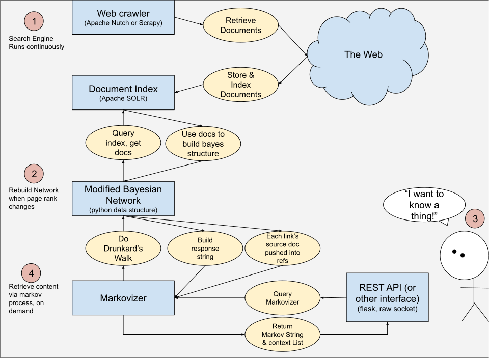
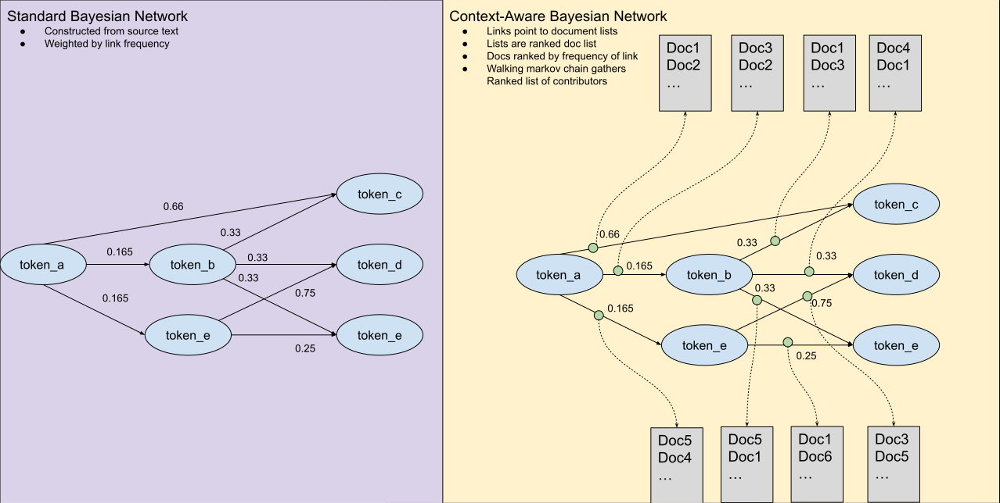
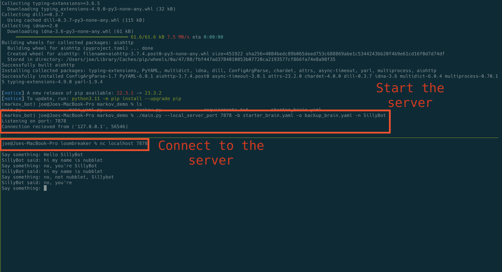
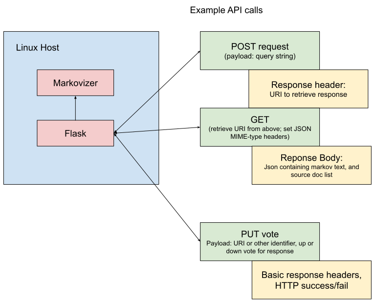
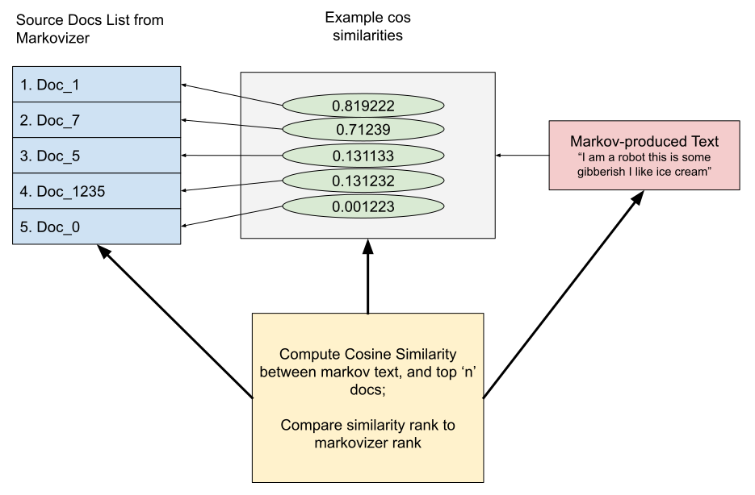

# Goals:
The target deliverables for this project are:
1. a basic search engine, including an index, page rank, & web crawler
2. a Bayesian network constructed from high-ranked documents
3. The links in the Bayesian network reference the documents that contributed to that link
4. A 'drunkards walk' is performed over the network to produce a string.
5. While walking the network, the documents that contribute to the link (retrieved from step 3) are recorded

Philosophically, this project is intended to be learning oriented; what we'd like to learn is whether we can add context to the results produced by generative AI.
This project is intended to be used as groundwork for a larger collection of personal, transparent,  Generative AI tools for web scraping.

Because we're more interested in learning something about the problem space, interesting discoveries should be discussed!

# General Description of Workflow
1. The Search Engine runs continuously
2. When page rank changes, the Bayesian network is rebuilt
3. A user or other agent makes a query, through some interface
4. The Markov process (drunkard's walk) produces a response string
  a. Additionally, a list of source documents is collected
  b. Both the response string and source documents are returned to the user

# What we build:
1. The Markovizer
2. the Bayesian network
3. A basic querying interface
### Stretch Goals:
1. REST interface
2. COS-similarity hueristic tool ... or another way to judge quality of citation rankings
3. Additional 'nice to haves' can be added based on participant skills

# the structure of the modified Bayesian network

# what we configure/install
1. SOLR
2. Web Scraper (Notch or Scrappy)

# How we'll interact with it
1. to start, we'll just use a raw socket, and connect to it with Netcat. If necessary (E.G., if nc isn't availible), Joe will write a minimal CLI client in Python.

2. Adding a REST interface w/ Flask or Django is a stretch goal, but a basic outline of that interface might look like this: 

3. adding a REST interface gives us more clear interaction and lets us use python Requests, Curl, or tools like Postman to interact with the server

# Example cosine similarity comparison
One stretch goal is to build a cosine similarity ranking for cited sources vs. the markov-produced result.
The goal is to build a hueristic to judge the quality of citations. Other options shoudl be considered.
Cosine ranking might look like this: 

# references, how we'll build
1. We'll use this guide to set up the search engine:
https://www.cs.toronto.edu/~muuo/blog/build-yourself-a-mini-search-engine/
2. Markov chains: I think this is a good introduction
https://towardsdatascience.com/introduction-to-markov-chains-50da3645a50d 
3. There's a lot of overlap between Bayesian netowrks and markov chains (markov chains are a specific type of Bayeyian network).
I like this article for an introduction to Bayesian networks:
https://towardsdatascience.com/introduction-to-bayesian-networks-81031eeed94e 
4. The drunkards walk is used to traverse the bayesian network and produce a statistically weighted output. For text, following this process tends to produce language-like results because chains are only formed by words that follow other words.
This is a good description of that process: https://medium.com/i-math/the-drunkards-walk-explained-48a0205d304 
5. we're kinda just scratching the surface of the math -- we'll build a graph datastructure, with probabilities between nodes. The math is interesting and important, but we don't need to do a deep-dive for this demo
6. Cosine Similarity:
https://towardsdatascience.com/a-complete-beginners-guide-to-document-similarity-algorithms-75c44035df90
7. Flask -- we may use this to set up a REST API
https://flask.palletsprojects.com/en/3.0.x/
8. Markov bot example code can be found in markov_demo in this repo
